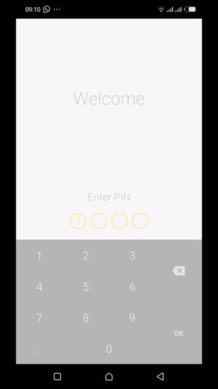

# CashTrack

CashTrack is a record taking app used to record cash collected in the bus PSV industry by conductors after each trip. It stores the data in a remote server as well as calculates the total income collected and expenses incurred. 

## Project Overview
As part of my Udacity Capstone Project - Android Developer Nanodegree, I design and plan and build my own app idea. The goal is to take the skills I’ve learnt across the Nanodegree journey and apply it to an app idea of my own that solves a real-world problem at the same time.

## What was learned
*	Planning the Design and implementation of a unique app idea
*	How to communicate an app idea formally using a description and a UI flow mock
*	Experience to own the full development cycle of an app

## Features
*	Create User
*	Add Vehicle
*	Add Collection/Expense
*	Display total collection and expense per vehicle
*	Calculate balance per vehicle
*	PIN authentication
*	Periodic **notification** reminders

### Preview

